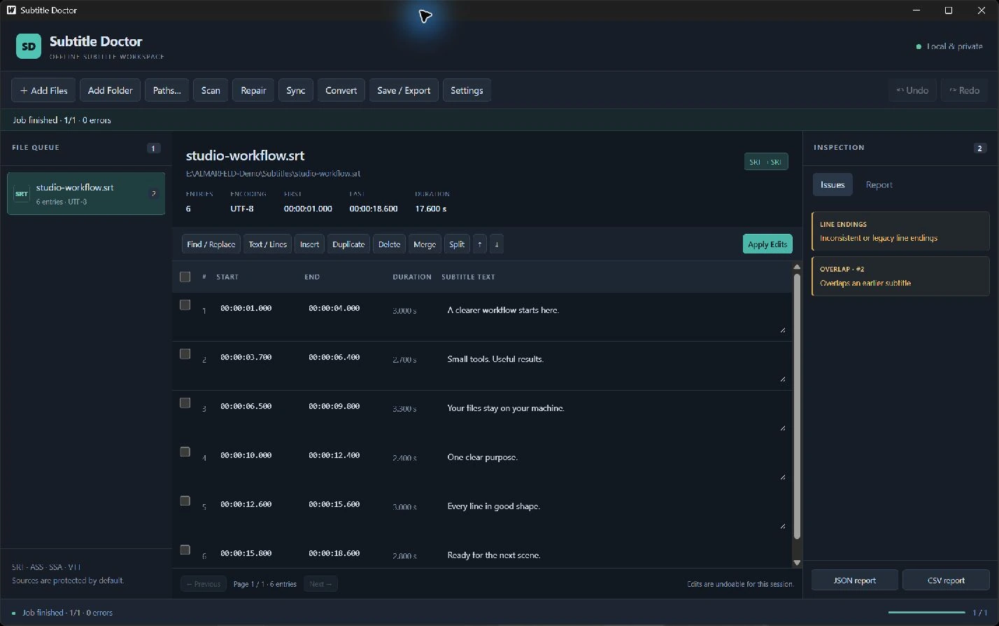

# Subtitle Doctor

A compact, offline Windows desktop workspace for inspecting, repairing, editing,
synchronizing, converting and batch-processing subtitle files.

Built with Go, Wails v2 and vanilla TypeScript. No accounts, telemetry, cloud
services, uploads, runtime PowerShell or runtime downloads.

## Current release and download

[Subtitle Doctor v1.0.0](https://github.com/AlinTibi/SubtitleDoctor/releases/tag/v1.0.0)
is the current Windows x64 release.

[Download the portable ZIP](https://github.com/AlinTibi/SubtitleDoctor/releases/download/v1.0.0/SubtitleDoctor-v1.0.0-win-x64.zip),
extract it, and run `SubtitleDoctor.exe`. Keep the extracted files together.
Microsoft Edge WebView2 Runtime is required. Install it separately if missing.

## Screenshots



## Supported formats

| Format | Import | Export | Styling |
| --- | --- | --- | --- |
| SRT | Yes | Yes | Inline text formatting |
| ASS | Yes | Yes | Existing styles and event fields retained for same-format output |
| SSA | Yes | Yes | Existing styles and event fields retained for same-format output |
| WebVTT | Yes | Yes | Cue identifiers/settings and header metadata retained for same-format output |

Cross-format conversion retains timing and dialogue. Basic bold, italic and
underline tags are translated between HTML and ASS syntax. Advanced styling,
positioning, karaoke, drawings, CSS and region features can be lost. Preview
and export dialogs warn about conversion loss. ASS/SSA use centisecond timing.

## Features

- Native single/multiple-file import, recursive folder import, drag and drop,
  and direct path/list import. Supports Windows paths with spaces and Unicode.
- Read-only scans: timestamps, negative/zero/short/long durations, overlaps,
  exact duplicates, duplicate timestamps, empty entries, ordering, numbering,
  malformed blocks, long lines, CPS, encoding, BOM and suspicious tags.
- Selectable repair options with preview: numbering, empty/duplicate removal,
  ordering, bounded duration repair, spacing, line endings, UTF-8 and BOM cleanup.
- Millisecond/second offsets, two-point linear correction and custom/preset FPS.
- Paged entry editor (200 rows/page): start/end/text, insert, delete, duplicate,
  merge contiguous entries, split at a word boundary and move within the page.
- Find/replace with match counts, case sensitivity, whole-word and Go RE2 regex.
- Text tools: trim, collapse spaces, normalize blank lines, explicit curly quotes,
  upper/lower/sentence case, HTML/ASS delimiter removal, join and word-safe wrapping.
  Wrapping refuses changes that cannot meet the configured line limits.
- Background import and batch operations with progress, per-file results and cancel.
- Session-only undo/redo, up to 100 snapshots with a 64 MiB approximate budget
  per file (at least one snapshot). No undo after closing the app.
- JSON/CSV reports and local persistent output/check settings.

## Output safety

Sources are never overwritten by default. Select an output folder in Settings or
Save / Export. Outputs use `_fixed` unless configured otherwise. Existing names
are protected with exclusive file creation and numbered collisions:
`movie_fixed.srt`, `movie_fixed (2).srt`, etc.

Suffixes must be nonempty, contain no Windows filename special/control characters,
and cannot end in a dot or space. Settings and export share this validation.
Automatic export encoding honors a prior UTF-8 repair; otherwise it uses the
preferred encoding in Settings. Choosing an encoding explicitly in Save / Export
overrides that choice. Batch Repair + Save honors the repair's encoding.
Replacing a source reparses the written content and updates its encoding/BOM state.

Replacing originals is optional and requires confirmation in a native warning
for each save job. A unique `.bak`, `.bak.2`, etc. backup must be written first.
Replacement uses a temporary file and checks that the source has not changed
since import or during saving. Replacements require the same format.

Invalid timing must be corrected before export. Unreadable blocks prevent export
to avoid silently losing dialogue; correct the source externally and reopen it.
Repairs never invent dialogue. Duration repair assigns a one-second end time,
bounded by a later next entry; the operation log asks you to review the timing.
Negative shifts are rejected transactionally rather than clamped.

Batch cancellation finishes an active safe write; already completed files remain.
A failed file keeps its session edits unchanged and reports its error.
Report export also requires a new filename, protecting existing reports.

## Build on Windows

Requirements: Go **1.25+**, Node.js **22.12+**, npm, Git, and an already installed
Microsoft Edge WebView2 Runtime (minimum 94.0.992.31). Current Windows systems
usually include WebView2. Install any missing runtime separately; the app checks
it before starting Wails and never downloads it.

```powershell
git clone https://github.com/AlinTibi/SubtitleDoctor.git
cd SubtitleDoctor
cd frontend
npm ci
npm run build
cd ..
go vet ./...
go test ./...
$wailsVersion = go list -m -f '{{.Version}}' github.com/wailsapp/wails/v2
go install "github.com/wailsapp/wails/v2/cmd/wails@$wailsVersion"
wails build -clean -s
.\build\bin\SubtitleDoctor.exe
```

The frontend **must be built before** `wails build -s`, which skips that step.
The exact Wails CLI version must match `go.mod` (currently **v2.16.0**).
Pull request CI repeats this sequence on Windows. The tag-triggered release
workflow packages the portable ZIP and checksum for approved releases.

## Keyboard shortcuts

| Shortcut | Action |
| --- | --- |
| Ctrl+O | Add subtitle files |
| Ctrl+S | Save / Export |
| Ctrl+Z | Undo session operation |
| Ctrl+Y | Redo session operation |
| Ctrl+F | Find / Replace |
| Delete | Delete selected rows outside text inputs |

Text inputs keep their native undo behavior. Table edits are staged until
**Apply Edits**. Changing files asks before discarding unapplied edits.

## Architecture and testing

`internal/model`, `parser`, `analyzer`, `repair`, `sync`, `convert`, `output`,
`report`, `settings` and `session` keep subtitle logic separate from Wails bindings.
The frontend renders pages rather than a full large file. Jobs run in Go
goroutines with context cancellation. All UI strings are English.

Repository fixtures contain original, freely reusable sample dialogue under the
MIT license. Tests cover parsing all four formats, diagnostics, repairs, timing
math, format conversion, Unicode/legacy encoding, preservation, backup and
concurrent filename collisions, regex, undo/redo, reports and settings persistence.

### Parser choice

[go-astisub](https://github.com/asticode/go-astisub) was evaluated because it supports
all four formats. This application uses a focused parser instead: inspection
must retain malformed timestamp entries and diagnostics rather than fail at the
first malformed cue, and same-format ASS/SSA output must retain raw style/event
metadata. The supported subset and conservative export checks are documented here.

## Limitations

- Windows amd64 is the verified desktop target. No installer or signed binary yet.
- No translation, video preview, media playback or waveform generation.
- UTF-8 and BOM-marked UTF-16 input are supported. Other bytes are assumed
  Windows-1252 with a visible warning; arbitrary legacy encoding detection is not
  available. Verify decoded dialogue. Output supports UTF-8, UTF-16LE and
  Windows-1252; unrepresentable output characters cause an error.
- Unsupported ASS event layouts, multiple event formats and unreadable blocks
  require external source correction. Text must be the last ASS event field.
- Automatic tag cleanup removes unmatched recognized HTML/WebVTT delimiters and
  preserves unsupported syntax for review. Class, voice, language and ruby spans
  follow the [WebVTT cue text rules](https://www.w3.org/TR/webvtt1/#webvtt-cue-text).
  Line-break tags retain their separation when formatting is removed. Case tools
  preserve tag attributes, entities and ASS override commands. Advanced ASS markup
  still requires manual review.
- Whole-word matching uses RE2 ASCII word boundaries. Regex replacement uses Go
  expansion syntax; use `${1}suffix` when a capture is followed by letters.
- Splitting distributes words around the timing midpoint; it does not infer speech
  timing. Row selection, merge and moves are within the visible page.
- Source file queue and editing history are session-only. Settings persist in
  `%APPDATA%\SubtitleDoctor\settings.json`; batch processing never re-imports outputs
  automatically.
- Backup creation is mandatory for replacement and cannot be disabled.

## License

[MIT](LICENSE). Copyright (c) 2026 AlinTibi.

## Support and security

For software questions, email [support@almarfeld.com](mailto:support@almarfeld.com).
Report reproducible bugs and feature requests in [Subtitle Doctor issues](https://github.com/AlinTibi/SubtitleDoctor/issues).
Do not post private files or credentials in public issues.

Report vulnerabilities privately to [security@almarfeld.com](mailto:security@almarfeld.com).
See [SUPPORT.md](SUPPORT.md) and [SECURITY.md](SECURITY.md).

---

**ALMARFELD** · Independent software development · [almarfeld.com](https://almarfeld.com)

[Subtitle Doctor product page](https://almarfeld.com/software/subtitle-doctor/) ·
[General enquiries](mailto:contact@almarfeld.com) · [MIT license](LICENSE)
